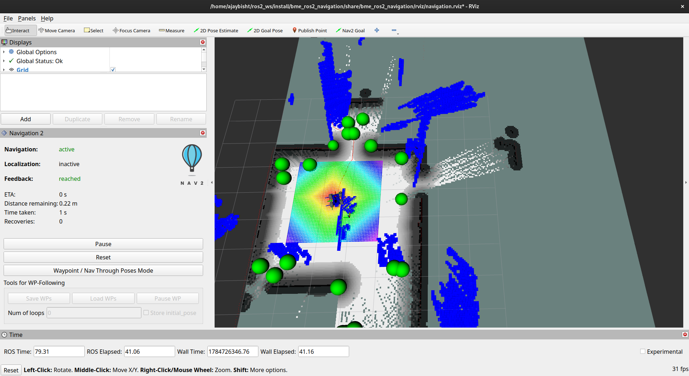

# Mecanum-Drive Mobile Robot with Autonomous Navigation & Exploration (ROS 2 Jazzy)

A mecanum-drive mobile robot simulated in Gazebo, built on ROS 2 Jazzy, capable of SLAM-based mapping, autonomous navigation, frontier exploration, and manual joystick teleoperation.

## Overview

This project evolved from an initial two-wheel differential-drive robot into a fully omnidirectional four-wheel mecanum platform. It integrates LiDAR, an IMU, and an RGB camera for perception, and uses the Nav2 stack for autonomous navigation and localization, along with `explore_lite` for frontier-based autonomous exploration of unknown environments.

## Key Features

- **Mecanum Drive Kinematics**: Omnidirectional movement (forward/backward, strafing, rotation in place) via a 4-wheel mecanum configuration, with per-wheel directional friction tuned in Gazebo for accurate roller behavior.
- **SLAM & Localization**: Real-time mapping using SLAM Toolbox, with AMCL-based localization against saved maps.
- **Autonomous Navigation**: Full Nav2 integration for path planning and waypoint following, including a dedicated waypoint-follower node.
- **Frontier Exploration**: Autonomous exploration of unmapped environments using `explore_lite`, identifying and navigating to map frontiers without manual input.
- **Manual Teleoperation**: Custom Arduino joystick controller streaming analog input over serial to a ROS 2 node, converted into `cmd_vel` commands in real time — including a hardware emergency-stop button.
- **Sensor Suite**: RGB camera, IMU, and 2D LiDAR, all modeled and simulated via Gazebo sensor plugins.
- **Simulation Environment**: Fully simulated in Gazebo Harmonic with a custom world, robot URDF/xacro description, and tuned physics.

## Tech Stack

- ROS 2 Jazzy
- Gazebo Harmonic
- Nav2 / SLAM Toolbox / AMCL
- explore_lite (m-explore-ros2)
- Python (rclpy) / pyserial
- Arduino (C++)
- URDF / Xacro

## Packages

- `bme_ros2_navigation` — robot description, world files, launch files, maps, and sensor/navigation configuration
- `bme_ros2_navigation_py` — Python nodes including waypoint following, initial pose setting, map loading, and joystick teleoperation
- `explore_lite` (from `m-explore-ros2`) — frontier-based autonomous exploration

## Motivation

Built as part of an ongoing robotics portfolio, this project explores the full navigation stack — mapping, localization, path planning, and autonomous exploration — alongside hardware teleoperation, bridging low-level Arduino input with a complete ROS 2 software stack.

## Commands

- `colcon build --packages-select bme_ros2_navigation bme_ros2_navigation_py explore_lite`
- `ros2 launch bme_ros2_navigation spawn_robot.launch.py`
- `ros2 launch bme_ros2_navigation mapping.launch.py`
- `ros2 launch bme_ros2_navigation navigation_with_slam.launch.py`
- `ros2 launch bme_ros2_navigation localization.launch.py`
- `ros2 launch explore_lite explore.launch.py`
- `ros2 run bme_ros2_navigation_py joystick_teleop`
## joystick controller 
Built a custom Arduino joystick teleoperation system with serial communication to ROS 2

## joystick controller to navigate into the different env
Building the map of an room using SLAM 

## Exlporation using SLAM with nav2
Implemented autonomous navigation using Nav2 (SLAM mapping, AMCL localization, path planning) and frontier-based exploration with explore_lite

